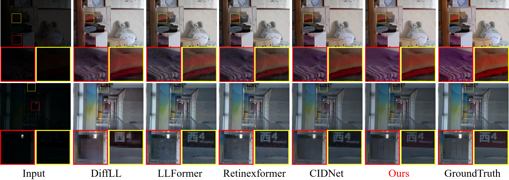

# [AAAI2026] ICLR: Inter-Chrominance and Luminance Interaction for Natural Color Restoration in Low-Light Image Enhancement

<div align="center">
  
[](https://arxiv.org/abs/2511.13607)

</div>

## Proposed ICLR

<details open>
<summary>

### **Motivation**

</summary>


</details>

<details open>
<summary>

### **ICLR pipeline**

</summary>


</details>

<details open>
<summary>

### **Introduction**

</summary>

Low-Light Image Enhancement (LLIE) task aims at improving contrast while restoring details and textures for images captured in low-light conditions. HVI color space has made significant progress in this task by enabling precise decoupling of chrominance and luminance. However, for the interaction of chrominance and luminance branches, substantial distributional differences between the two branches prevalent in natural images limit complementary feature extraction, and luminance errors are propagated to chrominance channels through the nonlinear parameter. Furthermore, for interaction between different chrominance branches, images with large homogeneous-color regions usually exhibit weak correlation between chrominance branches due to concentrated distributions. Traditional pixel-wise losses exploit strong inter-branch correlations for co-optimization, causing gradient conflicts in weakly correlated regions. Therefore, we propose an Inter-Chrominance and Luminance Interaction (ICLR) framework including a Dual-stream Interaction Enhancement Module (DIEM) and a Covariance Correction Loss (CCL). The DIEM improves the extraction of complementary information from two dimensions, fusion and enhancement, respectively. The CCL utilizes luminance residual statistics to penalize chrominance errors and balances gradient conflicts by constraining chrominance branches covariance. Experimental results on multiple datasets show that the proposed ICLR framework outperforms state-of-the-art methods.

</details>


## Main Results
<details open>
<summary>

### **Quantitative Results**

</summary>


</details>

<details open>
<summary>

### **Qualitative Results**

</summary>



</details>


## Get Started

### Dependencies and Installation
- Python 3.7
- Pytorch 1.13

1. Create Conda Environment

```
conda create --name ICLR python=3.7
conda activate ICLR
```

2. Install PyTorch

```
pip install torch==1.13.1+cu117 torchvision==0.14.1+cu117 torchaudio==0.13.1 --extra-index-url https://download.pytorch.org/whl/cu117
```

3. Clone Repo

```
git clone https://github.com/Derliye/ICLR.git
```
4. Install Dependencies

```
cd ICLR
pip install -r requirements.txt
```

### Data Preparation

You can refer to the following links to download the datasets.

- [LOLv1](https://daooshee.github.io/BMVC2018website/)
- [LOLv2](https://github.com/flyywh/CVPR-2020-Semi-Low-Light)

Then, put them in the following folder:

<details open> <summary>datasets (click to expand)</summary>

```
├── datasets
    ├── LOLdataset
        ├── our485
            ├──low
            ├──high
        ├── eval15
            ├──low
            ├──high
    ├── LOLv2
        ├── Real_captured
            ├── Train
            ├── Test
        ├── Synthetic
            ├── Train
            ├── Test
```

</details>

### Testing
We train on the LOLv1 dataset and test on the LOLv1, LOLv2-real and LOLv2-synthetic datasets to demonstrate the generalization performance of our method. The best weight we trained on the LOLv1 dataset are provided in the `./weights` folder and the corresponding test images are saved in the `./output` folder.

#### LOLv1
```
python eval.py --lol 
python measure.py --lol
```

#### LOLv2-real
```
python eval.py --lol_v2_real
python measure.py --lol_v2_real
```

#### LOLv2-syn
```
python eval.py --lol_v2_syn
python measure.py --lol_v2_syn
```

### Training
```
python train.py --lol_v1
```

## Citation
If you find our work useful for your research, please cite our paper
```
@misc{xu2025iclrinterchrominanceluminanceinteraction,
      title={ICLR: Inter-Chrominance and Luminance Interaction for Natural Color Restoration in Low-Light Image Enhancement}, 
      author={Xin Xu and Hao Liu and Wei Liu and Wei Wang and Jiayi Wu and Kui Jiang},
      year={2025},
      eprint={2511.13607},
      archivePrefix={arXiv},
      primaryClass={cs.CV},
      url={https://arxiv.org/abs/2511.13607}, 
}
```

## Acknowledgement

Our code is built upon [HVI-CIDNet](https://github.com/Fediory/HVI-CIDNet). Thanks to the contributors for their great work.
